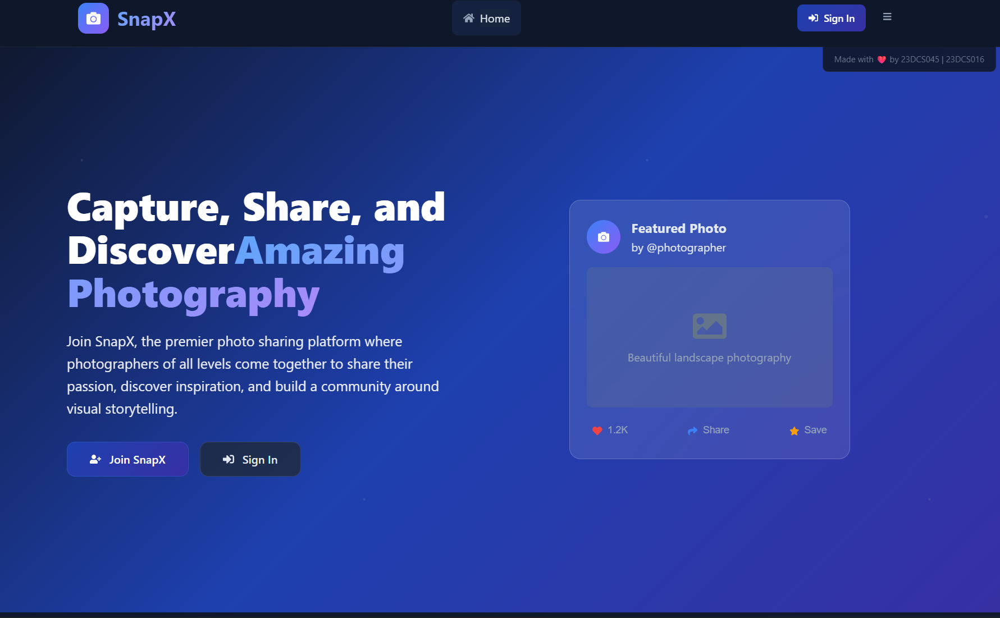
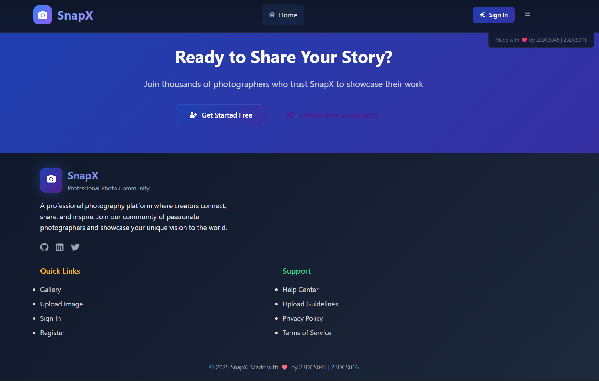
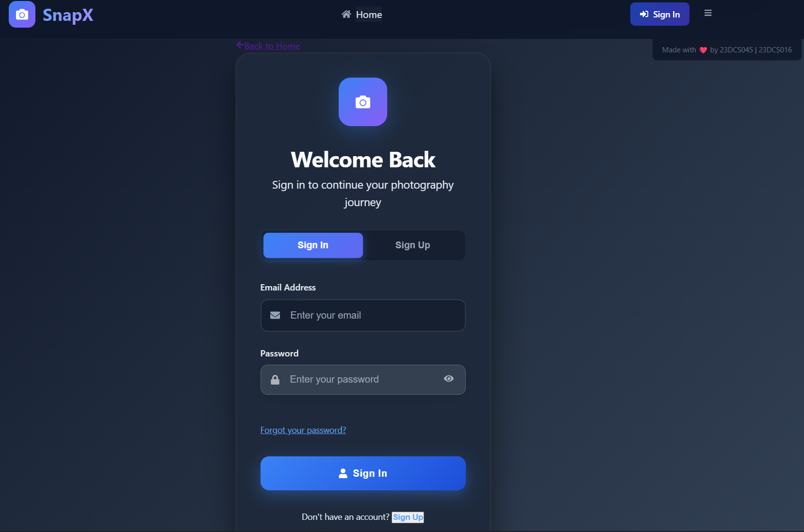
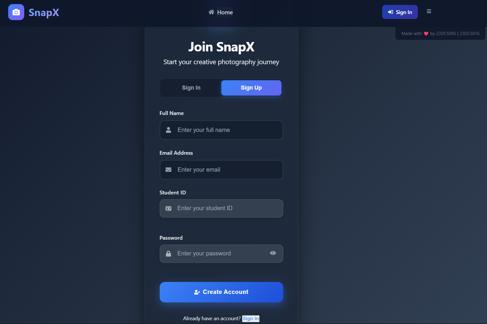
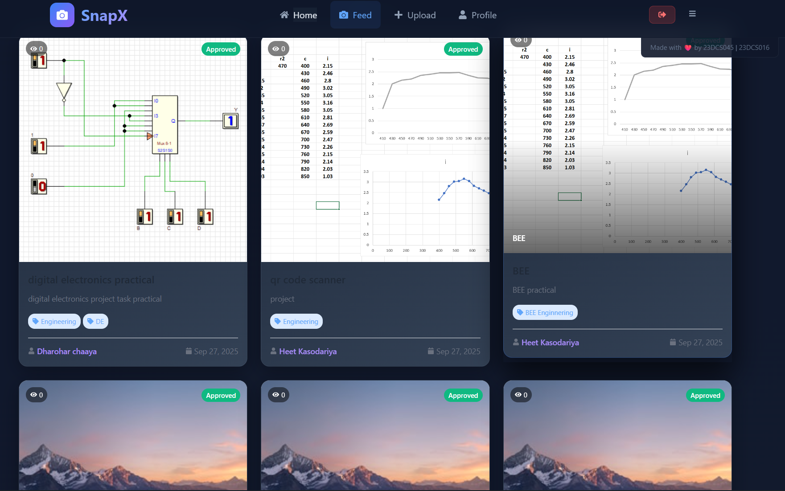
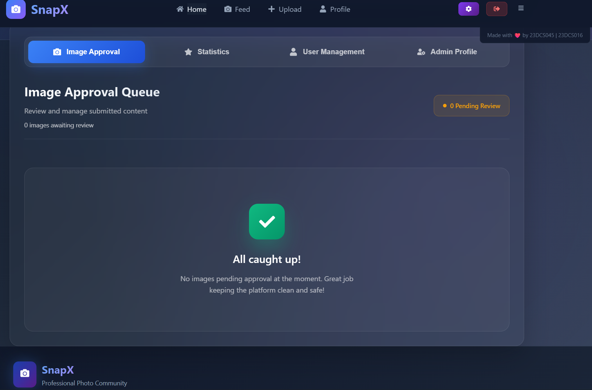

# SnapX - A Photo Sharing Platform 📸

<div align="center">
  
  
  [](https://reactjs.org/)
  [](https://vitejs.dev/)
  [](LICENSE)
  [](CONTRIBUTING.md)
</div>

**SnapX** is a modern and feature-rich photo sharing platform built using **React** and **Pure CSS**. It provides a seamless experience for both users and administrators, enabling efficient photo sharing, discovery, and management.

## 📑 Table of Contents

- [🌟 Features](#-features)
- [🎥 Demo Video](#-demo-video)
- [📸 Screenshots](#-screenshots)
- [🛠️ Tech Stack](#️-tech-stack)
- [🚀 Installation and Setup](#-installation-and-setup)
- [📂 Project Structure](#-project-structure)
- [🛠️ Limitations](#️-limitations)
- [🌟 Future Enhancements](#-future-enhancements)
- [👥 Team](#-team)
- [📱 Live Demo](#-live-demo)
- [🤝 Contributing](#-contributing)
- [📜 License](#-license)

---

## 🌟 Features

### For Users:

- **Browse Photos**: Explore a wide variety of photos with detailed descriptions and interactions.
- **Upload Photos**: Share your best shots with the community effortlessly.
- **Social Interactions**: Like, comment, and share photos with other users.
- **Search & Discover**: Find photos and photographers using smart search functionality.

### For Admins:

- **Image Approval**: Review and approve/reject user submissions.
- **User Management**: Manage user accounts and monitor community activity.
- **Admin Dashboard**: Comprehensive control panel for platform management.

---

## 🛠️ Tech Stack

### Frontend:

- **React**: For building a dynamic and responsive user interface.
- **Vite**: For fast development and optimized builds.
- **Pure CSS**: For modern and customizable styling without frameworks.

### Additional Tools:

- **React Router**: For client-side routing and navigation.
- **React Icons**: For beautiful and consistent iconography.
- **React Hot Toast**: For user-friendly notifications.

---

## 🚀 Installation and Setup

### Prerequisites:

- Node.js (v16 or higher)

### Steps:

1. Clone the repository:

   ```bash
   git clone https://github.com/HKPATEL3156/SnapX.git
   cd SnapX
   ```

2. Install dependencies:

   ```bash
   npm install
   ```

3. Start the development server:

   ```bash
   npm run dev
   ```

4. Open your browser and navigate to:
   ```
   http://localhost:5173
   ```

---

## 📂 Project Structure

```
SnapX/
├── src/
│   ├── components/     # Reusable React components
│   │   ├── Header.jsx
│   │   └── Footer.jsx
│   ├── pages/          # Main application pages
│   │   ├── Landing.jsx
│   │   ├── Feed.jsx
│   │   ├── Profile.jsx
│   │   ├── Upload.jsx
│   │   ├── Login.jsx
│   │   └── AdminDashboard.jsx
│   ├── context/        # React context for state management
│   │   └── AuthContext.jsx
│   ├── styles.css      # Custom CSS styles
│   ├── App.jsx         # Main application component
│   └── main.jsx        # Application entry point
├── screenshots/        # Application screenshots
├── package.json        # Project dependencies
├── vite.config.js      # Vite configuration
└── README.md           # Project documentation
```

---

## 🎥 Demo Video

Check out our live demo video showcasing all the features:

[](./screenshots/Demo-Vidio.webm)

_Click the image above to watch the demo video_

---

## 📸 Screenshots

### 🏠 Landing Page & Welcome Screen

<div align="center">
  
  <p><em>Beautiful landing page with modern design and call-to-action</em></p>
</div>

### 📱 Photo Feed & Discovery

<div align="center">
  
  <p><em>Interactive photo feed with like, comment, and share functionality</em></p>
</div>

### 📤 Image Upload Interface

<div align="center">
  
  <p><em>Intuitive image upload with drag & drop support and metadata</em></p>
</div>

### 👤 User Profile & Gallery

<div align="center">
  
  <p><em>Personal profile page showing user's photo collections</em></p>
</div>

### 🔐 Authentication & Login

<div align="center">
  
  <p><em>Secure login system with modern UI design</em></p>
</div>

### ⚙️ Admin Dashboard & Management

<div align="center">
  
  <p><em>Comprehensive admin panel for content moderation and user management</em></p>
</div>

---

## 🛠️ Limitations

### User Side:

- No real-time notifications for interactions.
- Limited photo editing capabilities.
- No advanced search filters by tags or categories.
- No direct messaging between users.

### Admin Side:

- No analytics or reporting dashboard.
- No bulk operations for image management.
- Limited user role management options.

### General:

- Currently runs as a frontend-only application.
- No backend API integration for data persistence.
- Limited offline functionality.

---

## 🌟 Future Enhancements

- **Backend Integration**: Add Node.js/Express backend with MongoDB.
- **Real-time Features**: Implement live notifications and messaging.
- **Advanced Search**: Add filtering by tags, categories, and dates.
- **Mobile App**: React Native version for iOS and Android.
- **Social Features**: Follow system, stories, and direct messaging.

---

## 👥 Team

- **Heet Kasodariya** (23DCS045) - Team Lead & Full Stack Developer
- **Dharohar Chhaya** (23DCS016) - UI/UX Designer & Frontend Developer

---

## 🤝 Contributing

Contributions are welcome! Please feel free to submit a Pull Request.

---

## 📜 License

This project is licensed under the MIT License. See the [LICENSE](LICENSE) file for details.

---

## 📱 Live Demo

� **Demo Video**: Available in `./screenshots/Demo-Vidio.webm`

🌐 **Google Drive**: [https://drive.google.com/drive/u/0/folders/1iK1yax-vL51J-dLjaJBLhRXq-GhPGOIw](https://drive.google.com/drive/u/0/folders/1iK1yax-vL51J-dLjaJBLhRXq-GhPGOIw)

---

Made with ❤️ by **Team WebWizards** for Hackathon 2025
